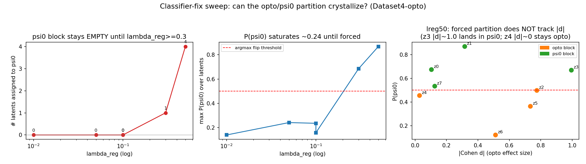

# Addendum — can the opto/ψ⁰ block partition be fixed cheaply? (sweep)

**Date:** 2026-06-03 · **Model:** `CITRISVAEKeypoints` · **Data:** `dataset4_pert_samples.npz`
· **Driver:** `experiments/sweep_classifier_fix.py` · **Raw:** `sweep_results.json`

The main report found a real **opto-responsive subspace** but a **collapsed discrete
partition**: the `TransitionPrior`/`TargetClassifier` assigned all 8 latents to the
opto block, leaving ψ⁰ (the opto-*invariant* block) empty. Before committing to the
heavier CITRIS-NF build, we tested whether the cheap levers fix it. **They do not in
any useful way.** This is a negative result, reported as such.

## What was varied (and what was not)

In the flow-prior path, the partition is controlled by two knobs:

- **`lambda_reg`** — adds `lambda_reg·(1 − P(ψ⁰))` to the prior NLL
  (`transition_prior.py:377`), directly rewarding latents for entering ψ⁰.
- **`classifier_gumbel_temperature`** — sharpness of the (prior + classifier)
  Gumbel-Softmax assignment sampling; lower = more decisive.

`beta_classifier` was held at the baseline **2.0 on purpose**: raising it strengthens
the opto-prediction gradient, which *reinforces* opto-block assignment — the wrong
direction. Everything else (split, seed, epochs, architecture) is identical to the
baseline `keypoints_dataset4.json` so runs are directly comparable.

## Results

| run | `lambda_reg` | temp | val_loss | max P(ψ⁰) | block split (opto/ψ⁰) | mean\|d\| opto | partition tracks \|d\|? |
|---|---|---|---|---|---|---|---|
| baseline | 0.01 | 1.0 | −141.6 | 0.12 | **8 / 0** | 0.40 | — (ψ⁰ empty) |
| lreg05 | 0.05 | 1.0 | −140.5 | 0.24 | **8 / 0** | 0.47 | — |
| lreg10 | 0.10 | 1.0 | −144.2 | 0.24 | **8 / 0** | 0.47 | — |
| lreg10_t05 | 0.10 | 0.5 | −144.4 | 0.16 | **8 / 0** | 0.63 | — |
| lreg30 | 0.30 | 0.5 | — | 0.69 | 7 / 1 | 0.59 | **no** (ψ⁰={z1, \|d\|=0.44}; z4 \|d\|=0.03 stays opto) |
| lreg50 | 0.50 | 0.5 | — | 0.87 | 4 / 4 | 0.51 | **no** (ψ⁰={z0,z1,**z3**,z7}; z3 \|d\|≈1.0 wrongly in ψ⁰; z4 \|d\|≈0 stays opto) |

## Reading

1. **The lever works, but saturates.** Raising `lambda_reg` monotonically lifts
   P(ψ⁰) (z0: 0.12 → 0.24), but it plateaus around **0.24** for `lambda_reg ≤ 0.1`
   — well below the **0.5** an argmax needs to flip. So ψ⁰ stays strictly empty
   through the whole "reasonable" range.
2. **You can force a flip, but it's not disentanglement.** Only at `lambda_reg ≥ 0.3`
   does ψ⁰ become non-empty, and the resulting partition **does not track the opto
   effect sizes** — which is the whole point. At `lambda_reg=0.5`, **z3 (|d|≈1.0, one
   of the strongest opto responders) is pushed into ψ⁰**, while **z4 (|d|≈0.03, the
   most opto-invariant latent and the goal-location dim) stays in the opto block**.
   The regularizer is overriding the data, not discovering structure.
3. **The effect-size subspace is robust.** Across all six runs the opto response is
   stable and even sharpens under lower temperature (mean |d| up to 0.63). The
   *representation* is fine; it is specifically the *discrete ψ⁰ declaration* that
   will not form correctly.

## Verdict & root cause

**The cheap classifier-side fix fails.** The collapse is not a tuning artifact — it
is the expected consequence of **`num_causal_vars = 1`**: a single, globally-acting
intervention (cortical inhibition perturbs reaching as a whole) leaves every latent
carrying *some* opto-predictive signal, so the prior always prefers the opto block.
CITRIS's clean block identifiability is designed for **multiple distinct intervention
targets**; with one binary channel the opto/ψ⁰ split is underdetermined, and no
amount of `lambda_reg`/temperature recovers a semantically correct partition.

**Implication for next steps.** Per the agreed plan ("if it has positive results,
move on"), the cheap path has **no genuine positive result**, so it is exhausted.
The remaining levers, in order of expected payoff:

- **CITRIS-NF** — decoupling representation (frozen AE) from disentanglement (flow)
  gives a cleaner latent geometry and *may* yield a better per-latent opto
  separation, but it **will not raise the identifiability ceiling** set by the single
  intervention channel. Worth trying for representation quality, not a guaranteed fix
  for the partition.
- **More intervention structure** (the actual root cause) — if the data admit any
  sub-structure in the perturbation (e.g. laser power levels, distinct stim sites, or
  treating a second behavioural variable as an intervention target), raising
  `num_causal_vars > 1` is what would genuinely give CITRIS traction. This contradicts
  the current instruction-doc contract (opto-only, port is not an intervention), so it
  is a scientific decision, not a code change.

**Bottom line:** keep the main report's conclusion — the model finds a real
opto-responsive subspace and an approximately invariant complement (incl. the
goal-location latent z4) — but the *formal* CITRIS block partition cannot be made
correct on this single-intervention dataset by classifier-side tuning.
