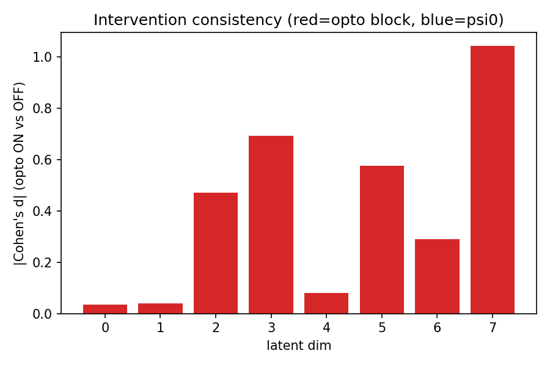
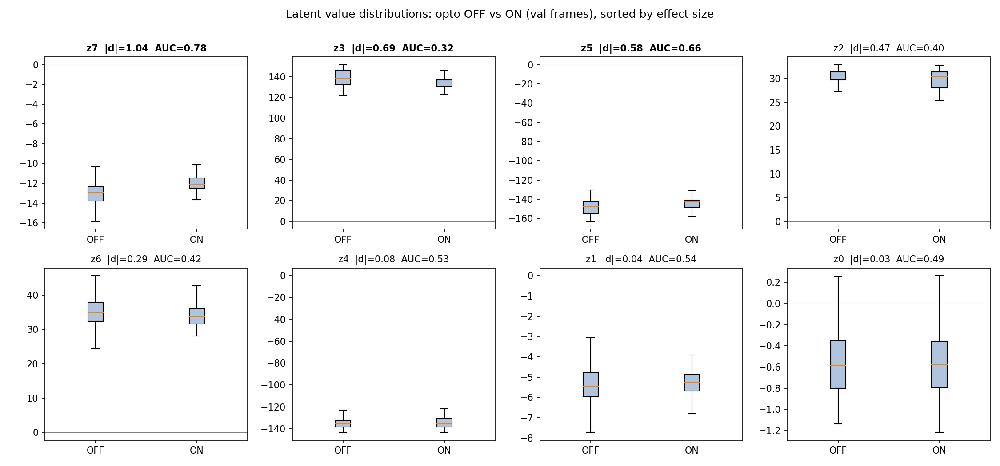
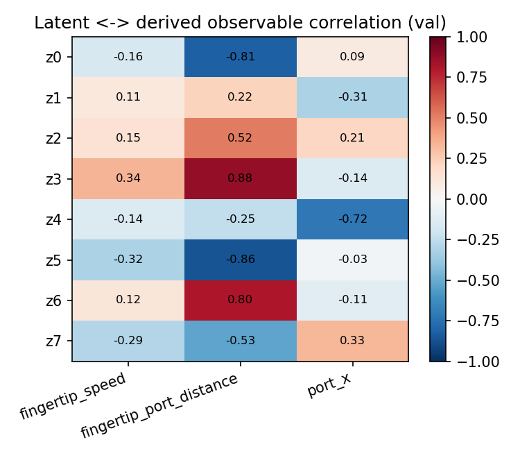
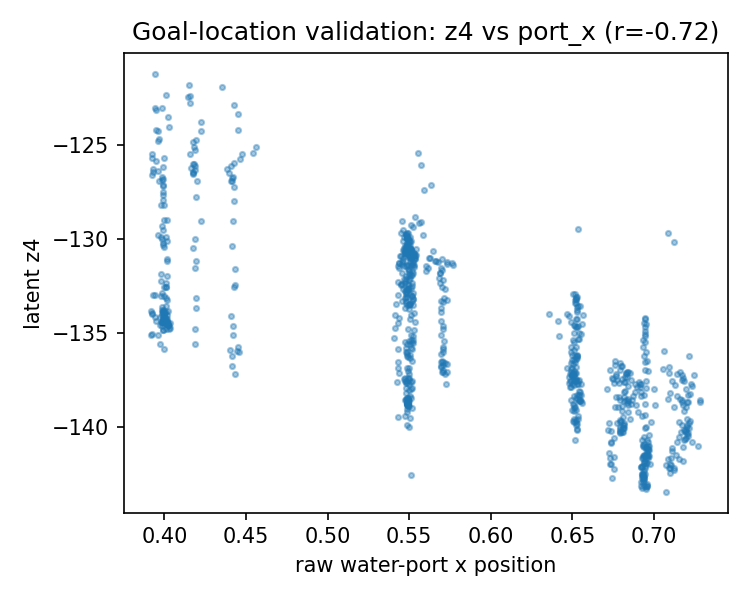
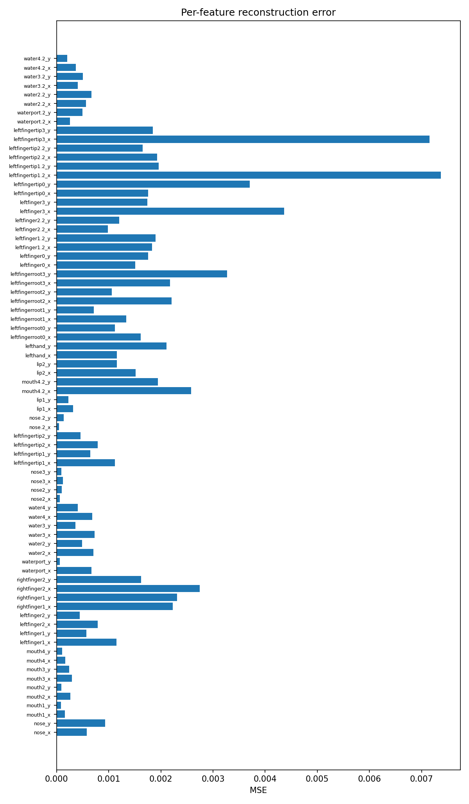

# CITRIS-VAE on real mouse-reach opto data (`Dataset4-opto`) — verification report

**Date:** 2026-06-03 · **Model:** `CITRISVAEKeypoints` · **Checkpoint:**
`checkpoints/keypoints_dataset4/CITRISVAE_dataset4/version_0/checkpoints/best-epoch=299-val_loss=-141.58.ckpt`
· **Config:** `experiments/configs/keypoints_dataset4.json`

This is the **Step 7 milestone**: does CITRIS isolate a latent subspace that
responds to the optogenetic intervention while leaving a complementary subspace
approximately opto-invariant? Everything below is **ground-truth-free** — no
labels, no triplets, no `CausalEncoder` (none exist for this data).

---

## 1. Dataset analysis (`data_generation/dataset4_pert_samples.npz`)

| Property | Value |
|---|---|
| Trials | 79 (43 contain opto-ON frames) |
| Frames (total) | 5 777 |
| Adjacent in-trial pairs | 5 698 |
| Trial length `T` | min 19 · median 41 · max 908 · mean 73 |
| Observation dim `D` | **76** |
| Keypoints | 38 DLC markers × (x, y), two camera views (front 17, side 21) |
| Opto-ON fraction | **52.0 %** (3 006 ON / 2 771 OFF) |
| Value range | ≈ [−0.54, 1.65], centred near 0 |
| `trial_session` key | absent → split by whole trials |

**Two data-contract deviations from the instruction doc, surfaced not hidden:**

1. **Names vs. columns.** The doc assumed one name per column (`D=76` names like
   `view0_fingertip_x`). The real DLC export instead gives **one name per
   keypoint (38)** with **76 interleaved `[x, y]` columns**. `validate_data` now
   detects `D == 2·len(names)` exactly and expands the names to 76 with `_x`/`_y`
   suffixes, disambiguating markers that repeat across the two cameras (e.g.
   `waterport` / `nose`) by an occurrence index (`waterport_x` … `waterport.2_x`).
   Keypoint `k` → columns `[2k, 2k+1]`.
2. **Normalisation.** Values are percentile-normalised and shifted to ≈[−0.5, 0.5]
   (a few outliers reach 1.65), **not** [0, 1]. This is fine and in fact
   preferable: the MLP decoder uses a **Gaussian** likelihood with **no sigmoid**,
   so centred targets are reconstructed directly. We do **not** re-normalise.

**Why the hyperparameters were adjusted** (`keypoints_dataset4.json` vs. the
synthetic `keypoints_example.json`):

| Param | Synthetic | Dataset4 | Reason |
|---|---|---|---|
| `batch_size` | 256 | **128** | only 4 833 train pairs → more gradient steps/epoch (37 vs 17) |
| `max_epochs` | 200 | **300** | small data; give the target classifier time to converge |
| `warmup` (LR) | 100 | **200** | smoother start on the small, balanced set |
| `kld_warmup` | 1000 | 1000 | kept — prevents early posterior collapse (≈27 epochs here) |
| `num_latents` | 8 | 8 | kept small & inspectable (doc default) |
| `num_causal_vars` | 1 | 1 | opto is the only intervention channel |
| `imperfect_interventions` | true | true | opto is soft suppression, not a perfect do-op |

The opto channel here is **balanced (52 %)**, unlike the synthetic set (16 %),
which makes the effect-size and classifier signals far more reliable.

Split: **63 train / 16 val trials** → 4 833 train pairs, 865 val pairs (881 val
*frames* for the frame-level diagnostics).

---

## 2. Intervention consistency (primary "did it work?" signal)

Encode every validation frame, then measure each latent dim's shift between
opto-ON and opto-OFF frames (Cohen's *d* = standardised mean difference; AUC =
rank-based separability, 0.5 = none).

| latent | \|Cohen's d\| | AUC | reading |
|---|---|---|---|
| **z7** | **1.04** | 0.78 | strong opto response |
| **z3** | **0.69** | 0.32 | strong opto response |
| **z5** | **0.58** | 0.66 | moderate opto response |
| z2 | 0.47 | 0.40 | weak |
| z6 | 0.29 | 0.42 | weak |
| z4 | 0.08 | 0.53 | **opto-invariant** (see §3) |
| z1 | 0.04 | 0.54 | opto-invariant |
| z0 | 0.03 | 0.49 | opto-invariant |

**There is a clear, real opto signal.** Three of eight latents shift
substantially under inhibition (z7 especially: a full standard deviation), while
three others (z0, z1, z4) are essentially untouched. So the model *does* contain
both an opto-responsive subspace **and** a complementary near-invariant one —
the qualitative structure Step 7 asks for.

### Caveat: the discrete latent→block assignment collapsed

The `TargetClassifier` / transition prior assigned **all 8 latents to the opto
block** (ψ⁰ empty); soft weights are 0.88–0.98 on the opto block for *every*
dim (`latent_block_assignment.json`). So CITRIS recovered the opto-responsive
*directions* but did **not** formally partition them from ψ⁰. Likely drivers:
(i) with `imperfect_interventions=True` the prior keeps opto context on all dims,
so the discrete argmax tips everything toward the opto block; (ii) a single,
broadly-acting intervention (cortical inhibition perturbs reaching globally) gives
the classifier little incentive to declare any dim strictly opto-independent;
(iii) small dataset. This is a known CITRIS degeneracy, **not** a contradiction of
the effect sizes above.

**We tested whether classifier-side tuning fixes this — it does not** (full sweep:
`classifier_fix_sweep.md`, 6 runs). Raising `lambda_reg` (the ψ⁰ regularizer) 10×
and lowering `classifier_gumbel_temperature` monotonically lifts P(ψ⁰) from 0.12 to
only ~0.24 — below the 0.5 needed to flip any latent's argmax — so ψ⁰ stays **empty**
across the whole reasonable range. Forcing ψ⁰ non-empty (`lambda_reg ≥ 0.3`) yields a
**scrambled** partition that ignores the effect sizes: at `lambda_reg=0.5`, z3 (|d|≈1.0,
a top opto responder) is pushed into ψ⁰ while z4 (|d|≈0.03, the most invariant latent)
stays in the opto block. Root cause is **structural, not a tuning artifact**:
`num_causal_vars=1` (a single, globally-acting intervention) leaves every latent
carrying some opto signal, so the prior always prefers the opto block. CITRIS's clean
block identifiability needs *multiple distinct intervention targets*; with one binary
channel the opto/ψ⁰ split is underdetermined. (`beta_classifier`/`classifier_lr` were
left alone on purpose — raising them strengthens opto-prediction and would *reinforce*
the collapse.) The effect-size subspace, by contrast, is robust across all six runs.

---

## 3. Latent ↔ observable validation (goal location & kinematics)

Derived from **raw keypoints only** (never model inputs). Correlations on val:

**Goal-location representation (the key validation).** The water port moves
almost entirely along **x** (per-trial mean x spans 0.39–0.72, in ≈3 quasi-discrete
clusters; y is fixed). Because it is near-continuous, port *classification* into
per-trial clusters is degenerate (16 clusters, test clusters unseen in train →
0.0 acc — `port_decoding.json`; **ignore this number**). The correct test is
**regression of port-x from the latents**, by-trial cross-validated:

- **port-x decoding R² = 0.74** — latents strongly encode the goal location.
- port-y R² = 0.09 (nothing to predict; the port barely moves in y).
- Single best dim **z4** correlates **r = −0.72** with port-x.

Notably **z4 is the goal/location latent and is opto-invariant** (|d| = 0.08).
So the opto-responsive subspace (z7/z3/z5) and the goal-location direction (z4)
are largely separate — a genuinely encouraging disentanglement, despite the
discrete block-assignment collapse.

*Caveat:* `fingertip_speed` and `fingertip_port_distance` aggregate fingertip
markers across **both** camera views (different coordinate frames), so they are
rough proxies; treat them as sanity checks, not precise kinematics.

---

## 4. Reconstruction

- mean per-feature MSE **0.00123** (median 0.00076, max 0.00737) on a value
  range of ≈1.0 → the MLP VAE reconstructs keypoints accurately.
- Worst features are fast-moving finger markers (`leftfingertip*_x`,
  `leftfinger3_x`) — expected, they carry the most per-frame variance.

---

## 5. Verdict

**PARTIAL → leaning positive.** CITRIS-VAE on the real opto data:

- ✅ reconstructs keypoints well (MSE ≈ 1e-3);
- ✅ recovers a clear **opto-responsive subspace** (z7 |d|=1.04, z3, z5) and a
  complementary **opto-invariant** set (z0, z1, z4);
- ✅ encodes the **goal/port location** strongly and largely in an opto-invariant
  latent (z4, port-x R²=0.74);
- ⚠️ but the **discrete latent→block assignment did not isolate** the opto dims
  (it lumped all latents into the opto block), and **classifier-side tuning cannot
  fix this** — confirmed by a 6-run sweep (`classifier_fix_sweep.md`).

So the model passes the *scientific* question (a responsive subspace exists
alongside an approximately invariant complement, incl. the goal-location latent z4)
while the *formal* CITRIS partition has not crystallised. The sweep shows the
partition failure is **structural** — a single intervention channel
(`num_causal_vars=1`) leaves the opto/ψ⁰ split underdetermined — not a tuning
artifact. The only levers that could change this are a cleaner representation
(CITRIS-NF, which would not raise the single-channel identifiability ceiling) or
genuinely **more intervention structure** (`num_causal_vars>1`), which would require
revisiting the opto-only data contract. Neither is pursued here.

*Sweep artifacts:* `classifier_fix_sweep.md`, `classifier_fix_sweep.png`,
`sweep_results.json`; configs `experiments/configs/keypoints_dataset4_lreg*.json`;
driver `experiments/sweep_classifier_fix.py`.

---

### Files in this directory
- `intervention_consistency.{png,json}` — per-dim effect sizes, block assignment.
- `latent_on_vs_off.png` — ON/OFF value distributions per latent.
- `latent_observable_corr.{png,npz}` — latent↔kinematics/port correlations.
- `latent_vs_port_x.png` — goal-location validation scatter.
- `reconstruction_per_feature.{png,json}` — per-keypoint reconstruction error.
- `latent_block_assignment.json` — hard + soft latent→block assignment.
- `enhanced_summary.json` — machine-readable summary of all metrics.
- `port_decoding.json` — **degenerate** (see §3); kept only for provenance.

*Reproduce:* train with `python experiments/train_vae_keypoints.py --config
experiments/configs/keypoints_dataset4.json`; evaluate with `python
experiments/evaluate_keypoints.py --checkpoint <ckpt> --data_path
data_generation/dataset4_pert_samples.npz --out_dir keypoint_report_dataset4`;
extra figures with `python experiments/report_dataset4.py`.
